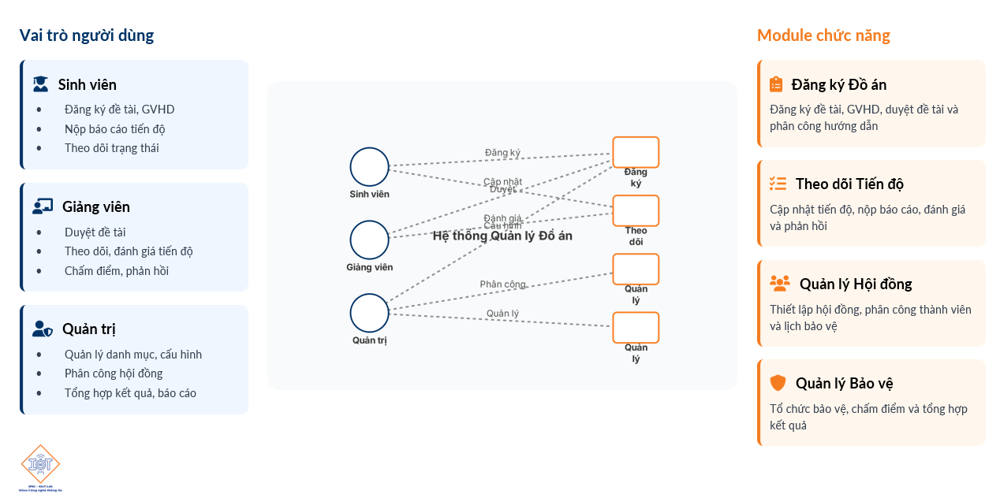

<div align="center">
    <h1>🎓 Hệ thống Quản lý Đồ Án Tốt Nghiệp (FIT – Đại học Đại Nam)</h1>
    <p>
        <a href="https://dainam.edu.vn/vi/khoa-cong-nghe-thong-tin">Khoa Công nghệ Thông tin – Trường Đại học Đại Nam</a>
    </p>
  
    <p align="center">
        <!-- Thay ảnh logo bằng file của bạn trong thư mục docs/ (ghi chú bên dưới) -->
        
        
        
    </p>
  
    <p>
        <a href="https://www.facebook.com/DNUAIoTLab"></a>
        <a href="https://dainam.edu.vn/vi/khoa-cong-nghe-thong-tin"></a>
    </p>
</div>

---

Hệ thống hỗ trợ quản lý toàn bộ vòng đời đồ án tốt nghiệp: đăng ký đề tài, theo dõi tiến độ, phân công hội đồng, tổ chức bảo vệ và chấm điểm. Đây là phiên bản MVP (Minimum Viable Product) để tiếp tục phát triển hoàn thiện.

> Lưu ý ảnh minh họa: đặt file ảnh vào thư mục `docs/` và thay thế các đường dẫn được đánh dấu trong README (đã chú thích ở từng nơi).

## Mục lục

- Giới thiệu nhanh
- Tính năng chính
- Kiến trúc & Công nghệ
- Cấu trúc thư mục
- Hướng dẫn cài đặt và chạy
- Cấu hình môi trường (.env)
- API tiêu biểu (ví dụ JSON)
- Ảnh chụp màn hình (placeholders)
- Lộ trình phát triển
- Đóng góp & Quy tắc
- Liên hệ

## � Giới thiệu nhanh

- Dành cho: Sinh viên, giảng viên, quản trị khoa.
- Mục tiêu: Chuẩn hóa quy trình đồ án tốt nghiệp, giảm thao tác thủ công, tăng tính minh bạch và tra cứu.
- Trạng thái: MVP hoạt động với các chức năng lõi; sẵn sàng mở rộng.


## 🚀 Tính năng chính

- Sinh viên: đăng ký đề tài, theo dõi tiến độ, xem lịch bảo vệ, xem thông báo.
- Giảng viên: duyệt/điều phối đề tài, xem lịch hội đồng, chấm điểm và nhận xét.
- Quản trị: tạo hội đồng, phân phiên – phân vai trò (Chủ tịch/Thư ký/Phản biện), sắp lịch đề tài theo phiên, quản lý thẻ (tags) chuyên môn.
- Tổng hợp báo cáo, thống kê.
- Xử lý ràng buộc nghiệp vụ quan trọng (ví dụ: 1 giảng viên chỉ tham gia 1 hội đồng trong cùng một ngày; không chọn giảng viên hướng dẫn làm thành viên hội đồng của chính đề tài đó, v.v.).

## 🗂️ Mô hình tổng thể hệ thống

> 

*Hình minh họa mô hình tổng thể: Vai trò người dùng và các module chức năng chính.\

## 🧩 Kiến trúc & Công nghệ

| Tầng | Công nghệ |
|------|-----------|
| Backend API | ASP.NET Core 8 (C#), Entity Framework Core, Swagger |
| Frontend | React + TypeScript + Vite, TailwindCSS, Framer Motion |
| CSDL | SQL Server |
| Giao tiếp | JSON over HTTP (Fetch API) |
| Công cụ | GitHub, VS Code |

Sơ đồ kiến trúc (thêm ảnh minh họa tại `docs/architecture.png`):


## � Cấu trúc thư mục

Monorepo gồm frontend và backend:

```
dnu-thesis-system/
├─ ThesisManagement.Api/        # Backend ASP.NET Core 8
└─ thesis-frontend/             # Frontend React + TypeScript + Vite
```

Chi tiết một số thư mục chính:

- `ThesisManagement.Api/Controllers`: REST Controllers (Committee, Topics, LecturerProfiles,...)
- `ThesisManagement.Api/DTOs`: DTO contracts và ApiResponse wrapper
- `thesis-frontend/src/pages`: Các trang (admin, lecturer, student)
- `thesis-frontend/src/api`: `fetchData` và API clients (`committeeAssignmentApi`)
- `thesis-frontend/src/context`: Toast, Auth context

> Có thể bổ sung một sơ đồ module cho frontend tại `docs/frontend-modules.png`.

## ⚙️ Hướng dẫn cài đặt và chạy

Yêu cầu tối thiểu:

- Node.js >= 18 và npm
- .NET SDK 8.0
- SQL Server

Clone và cài đặt phụ thuộc:

```bash
# 1) Clone repo
git clone https://github.com/huuhuy2910/dnu-thesis-system.git
cd dnu-thesis-system

# 2) Frontend: cài đặt dependencies và chạy dev server
cd thesis-frontend
npm install
npm run dev

# 3) Backend: chạy API (mặc định Development)
cd ../ThesisManagement.Api
dotnet restore
dotnet run
```

Mặc định, frontend dùng proxy cấu hình trong `vite.config.ts` hoặc `.env` (cập nhật theo môi trường của bạn).

## 🔐 Cấu hình môi trường (.env)

Tạo file `thesis-frontend/.env` (ví dụ):

```bash
VITE_API_BASE_URL=http://localhost:5145/api
VITE_APP_NAME=DNU Thesis System
```

Tạo `ThesisManagement.Api/appsettings.Development.json` phù hợp với kết nối SQL Server và cấu hình CORS.

## 🧪 API tiêu biểu (ví dụ JSON)

Ví dụ: Lấy thông tin lịch bảo vệ của sinh viên hiện tại.

Endpoint:

```
GET /api/CommitteeAssignment/student-defense/{studentCode}
```

Response mẫu (rút gọn):

```json
{
    "success": true,
    "data": {
        "studentCode": "STU005",
        "topicCode": "TOP2025_005_AI",
        "title": "Hệ thống dự đoán điểm học tập",
        "committee": {
            "committeeCode": "COM20251023001",
            "name": "HỘI ĐỒNG 1",
            "defenseDate": "2025-10-30T00:00:00",
            "room": "302 - GD1",
            "session": 1,
            "startTime": "08:45:00",
            "endTime": "09:30:00",
            "members": [ { "name": "Phan Đức Anh", "role": "Chủ tịch" }, ... ]
        }
    }
}
```

Frontend đã sử dụng client `committeeAssignmentApi.getStudentDefense(studentCode)` để gọi API này và hiển thị dữ liệu thật trong các trang lịch/sinh viên.

## 🖼️ Ảnh chụp màn hình (đặt file vào docs/)

> Thay thế ảnh minh họa bên dưới bằng ảnh thật của hệ thống, đặt trong thư mục `docs/`. Cần chuẩn bị tổng cộng 4 ảnh để minh họa cho các giao diện chính.

- Trang giới thiệu chính: `docs/screen-homepage.png` (Trang chủ hoặc trang đăng nhập chính của hệ thống)
- Giao diện Admin: `docs/screen-admin-dashboard.png` (Dashboard quản trị viên với các chức năng quản lý)
- Giao diện Lecturer: `docs/screen-lecturer-dashboard.png` (Dashboard giảng viên với lịch hội đồng và quản lý đề tài)
- Giao diện Student: `docs/screen-student-dashboard.png` (Dashboard sinh viên với tiến độ và lịch bảo vệ)

Bạn có thể nhúng ảnh như sau:

```md


```

## �️ Lộ trình phát triển (Roadmap rút gọn)

- [ ] Thêm phân quyền chi tiết (role-based trên từng chức năng)
- [ ] Đồng bộ email/thông báo real-time
- [ ] Tự động gợi ý lịch dựa trên xung đột phòng & giảng viên
- [ ] Bộ báo cáo nâng cao và xuất dữ liệu

## 🤝 Đóng góp

Rất hoan nghênh các ý kiến/đóng góp:

1. Fork dự án và tạo nhánh mới từ `main`.
2. Commit thay đổi theo từng phần rõ ràng.
3. Mở Pull Request với mô tả chi tiết (ảnh chụp nếu có).

Quy ước mã nguồn: TypeScript strict mode ở FE; API trả về theo `ApiResponse<T>` ở BE.

## 📬 Liên hệ

- Email: 
    - nguyenhuuhuy489@gmail.com
    - nguyenbinh041104@gmail.com

Hoặc mở issue trên GitHub nếu bạn gặp lỗi/cần tính năng.

---

Copyright © 2025


